# HTTP代理服务器实验

## 实验目的

问题：使用http代理服务器访问HTTPS站点时，通信传输内容是否会被代理服务器“看到”？

结论：代理服务器不知道客户端和服务器的HTTPS通信内容，但代理服务器知道客户端访问了哪个HTTPS站点，这是由http代理的协议机制决定的：代理客户端会发送Connect请求到http代理服务器。

验证实验：在Kali Linux中安装tinyproxy，然后用主机设置浏览器代理指向tinyproxy建立的HTTP正向代理，在Kali中用wireshark抓包，分析抓包过程，理解HTTP正向代理HTTPS流量的特点。

提醒：HTTP代理服务器在转发客户端请求时，可能会添加Via字段，从而向目标站点暴露客户端正在使用代理访问。类似的，匿名通信应用tor的部分出口节点也会在http请求中自动加入via字段，向被访问站点宣告：当前请求正在使用匿名通信网络tor提供的匿名通信服务。

## 实验要求

- [x] 在Kali Linux中安装tinyproxy，然后用主机设置浏览器代理指向tinyproxy建立的HTTP正向代理
- [x] 在Kali中用wireshark抓包，分析抓包过程，理解HTTP正向代理HTTPS流量的特点

## 实验环境

- VirtualBox

- 网络拓扑

  | Attacker  | Victim         | gateway        |
  | --------- | -------------- | -------------- |
  | 10.0.2.15 | 172.16.111.137 | 192.168.56.113 |

## 实验过程

### 1.测试连通性

- Attacker 可以ping Gateway-Debian 并可以上网

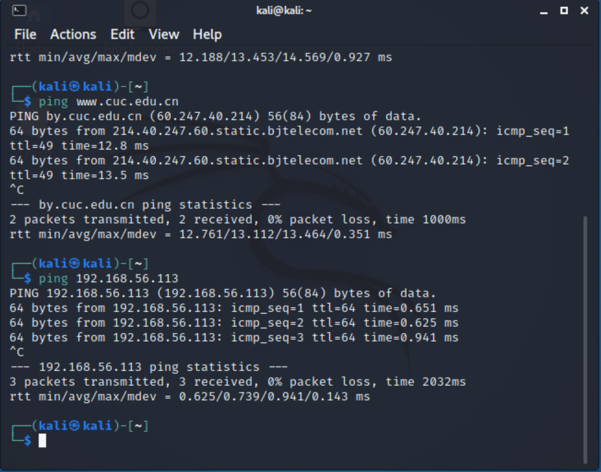

- Attacker ping 不通 Victim

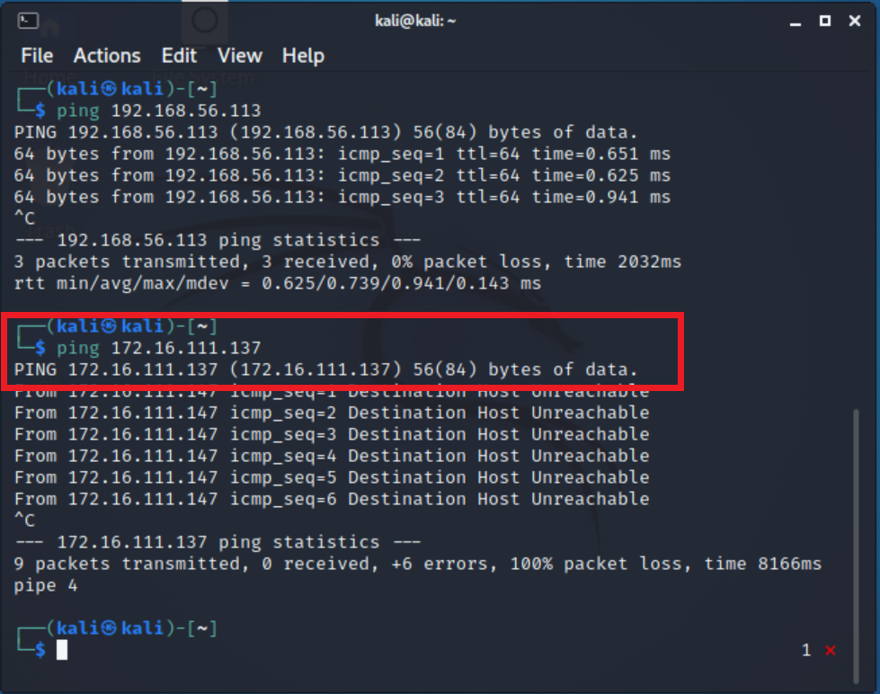

- Gateway-Debian 可以 ping Attacker 和 Victim

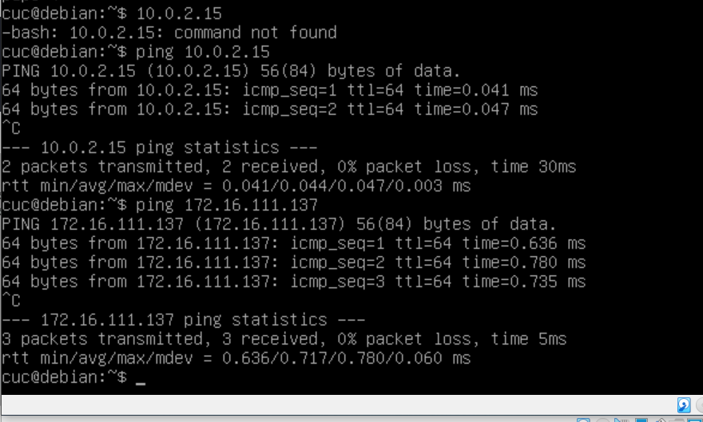

- Victim可以 ping  Attacker、Gateway-Debian并且可以上网

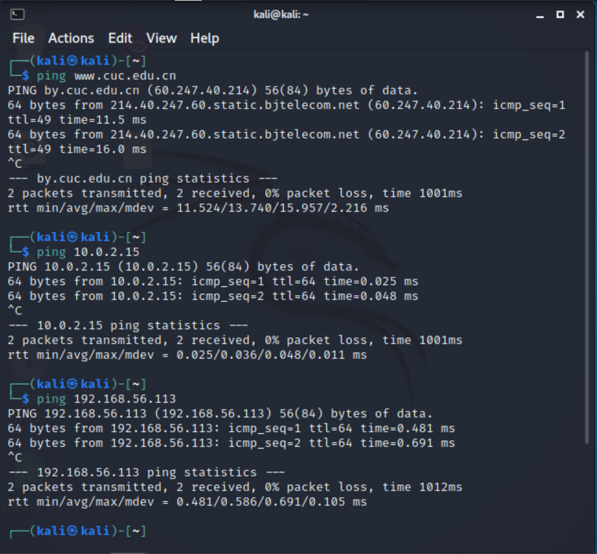

### 2.网关上安装tinyproxy

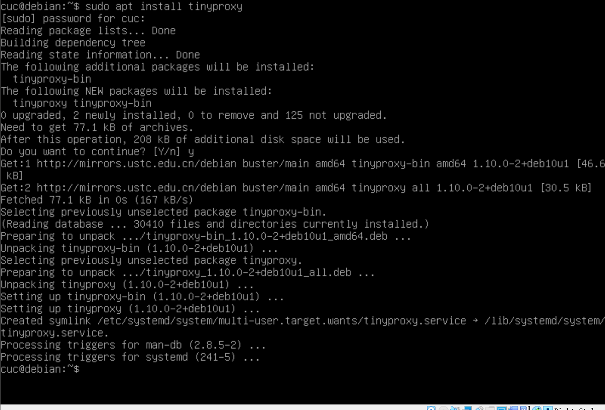

### 3.配置文件修改

```bash
编辑tinyproxy，取消Allow 10.0.0.0/8行首注释
vim /etc/tinyproxy/tinyproxy.conf
```

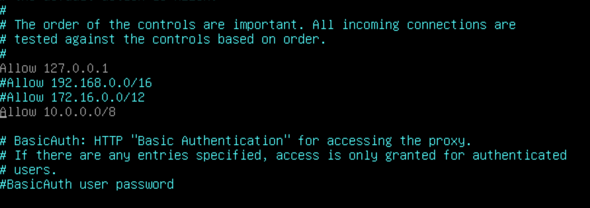

```bash
开启tinyproxy服务
/etc/init.d/tinyproxy start
```


### 4.对于Attacker

- 在浏览器preference中输入connection搜索connection settings

- 选择`Manual proxy configuration`，并在 HTTP Proxy一栏输入网关的NAT网络地址，端口和 `tinyproxy.conf文件中`的一致


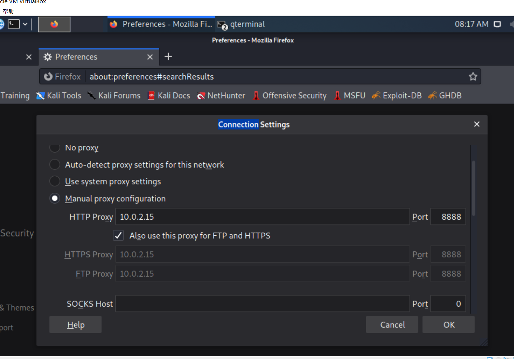

### 5.对于Victim

```bash
# 开启服务
sudo service apache2 start
```


### 6. Attacker抓包

- 开始抓包

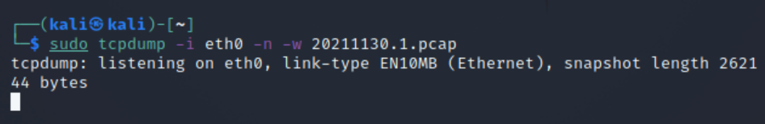

- 访问Victim

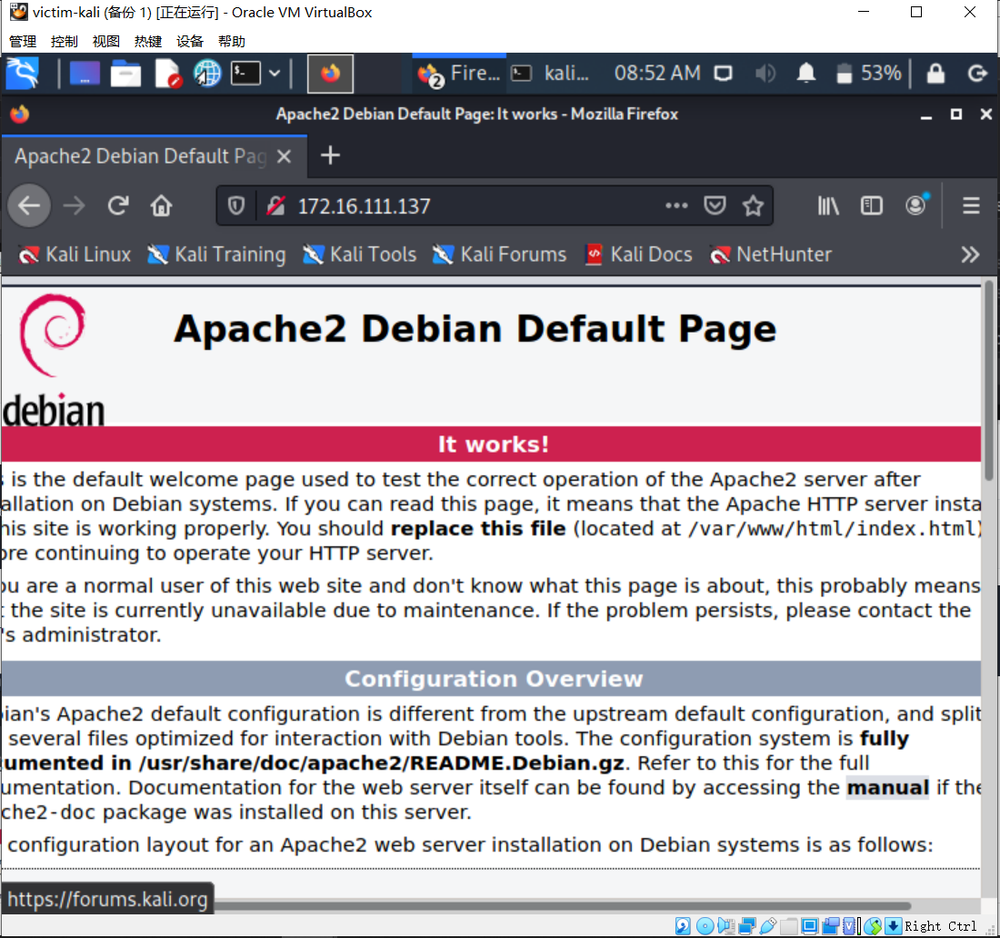

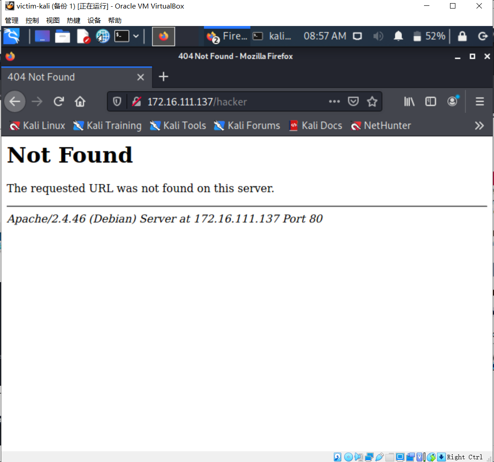

- 抓包结束，分析抓包结果

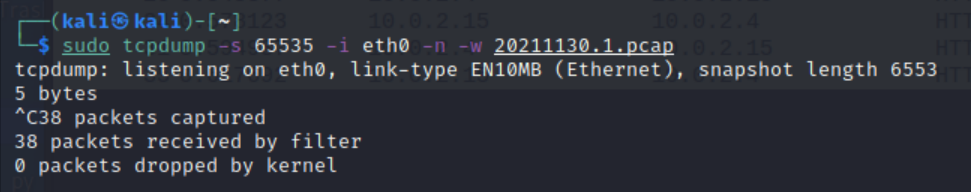

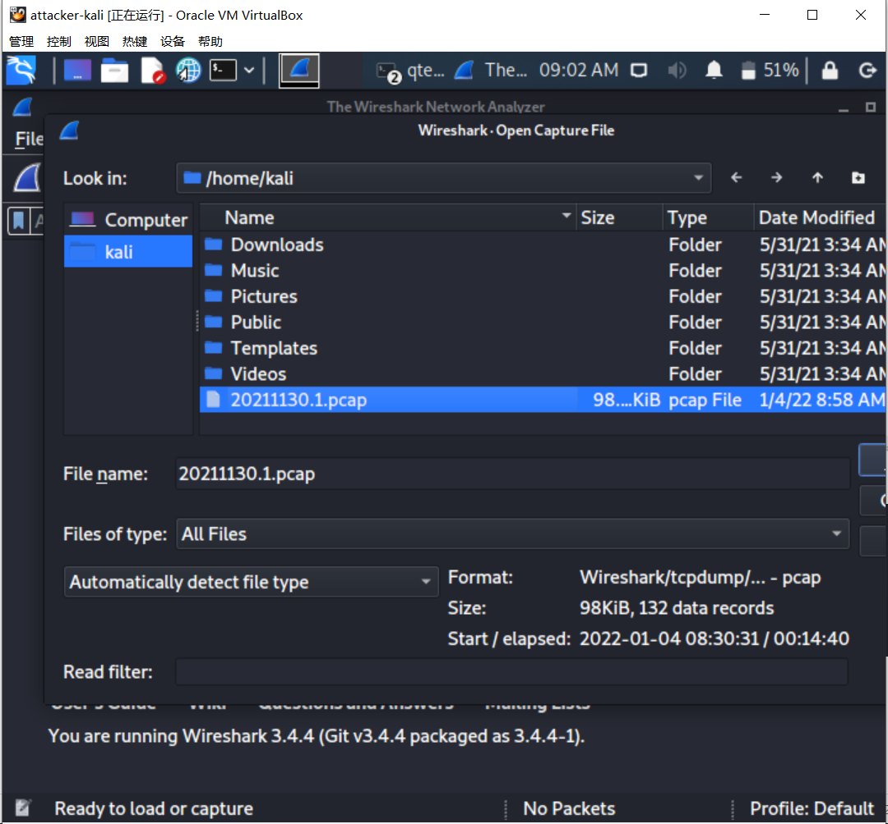

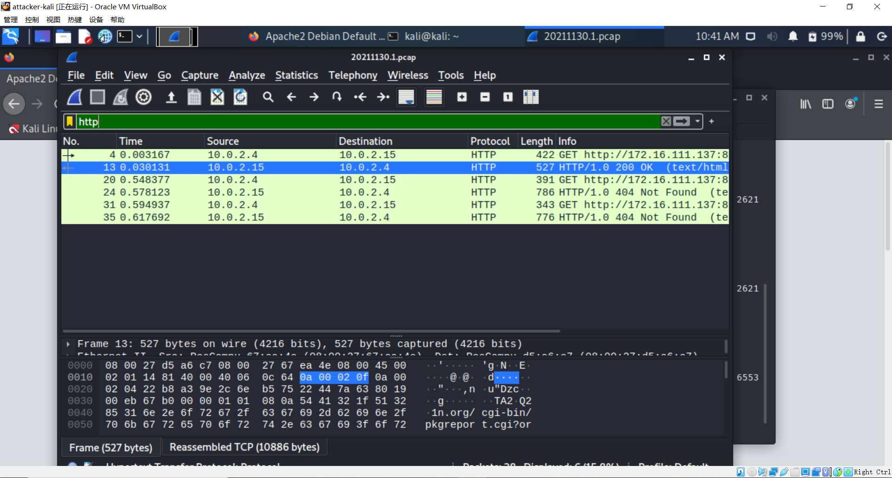

- 能看到代理`1.1 tinyproxy (tinyproxy/1.10.0)`，但是看不到具体的信息（例如ip地址）

### 7.对于网关，抓包并分析

```bash
sudo tcpdump -i enp0s3 -n -w 20210919.2.pcap

# 复制文件到本机桌面上
scp cuc@192.168.56.113:/home/cuc/20210919.2.pcap ./
```

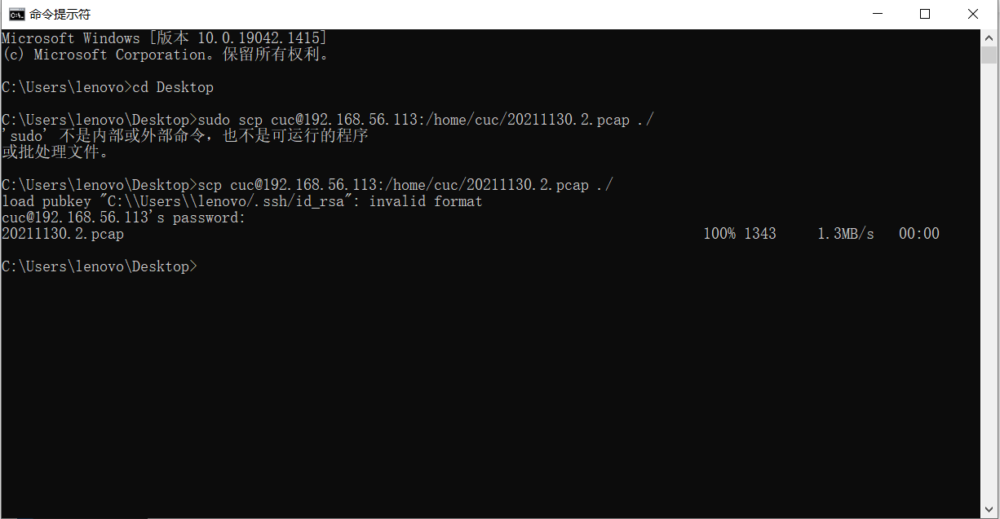

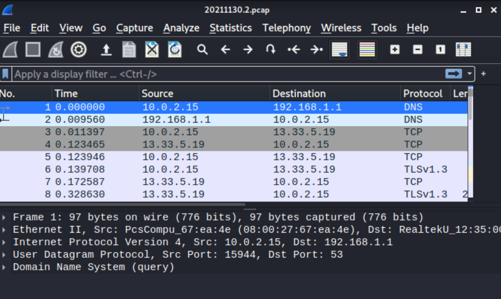

- 网关（代理服务器）行为分析
  - 网关保留HTTP GET请求内容，若攻击者主机（客户端）的浏览器不清除历史记录，则下次访问同样的HTTP服务时用时非常短
  - 若在网关设置防火墙规则过滤攻击者主机（客户端）发出的的请求，则攻击者主机（客户端）依然无法访问靶机端（服务器）的HTTP服务
  - 代理层可以理解HTTP报文

### 8.对于victim

服务器行为分析

- HTTP协议中出现Via字段，说明网关（代理服务器）正在提供代理服务
- 攻击者主机IP地址、以太网接口均未暴露

### 9.对于Attacker

- 访问www.cuc.edu.cn,抓包分析，通过代理访问HTTPS站点

  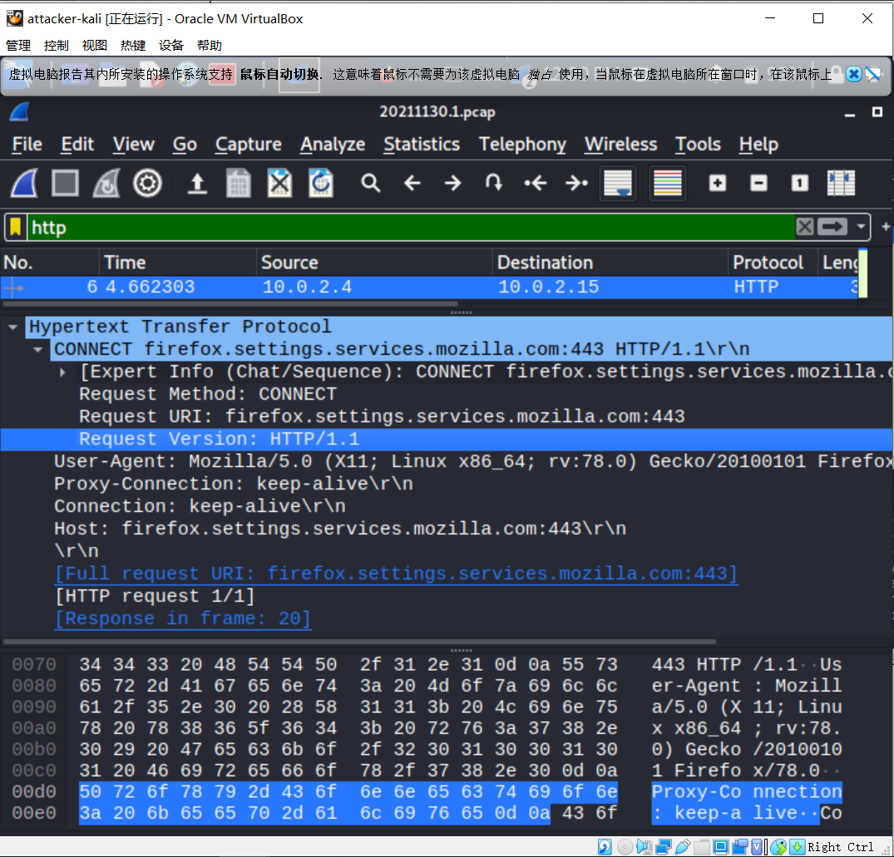

- HTTPS服务建立连接后，用户与网站进行加密通信

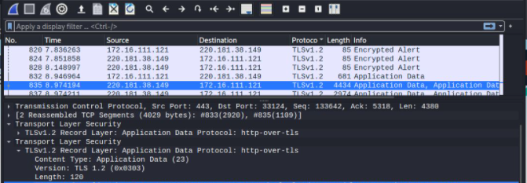

## 问题解决

- victim中proxy拒绝连接

  解决：[修改配置](https://blog.csdn.net/haiguijiujian/article/details/114960182)

